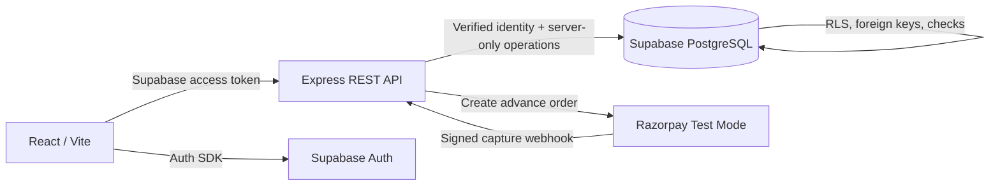
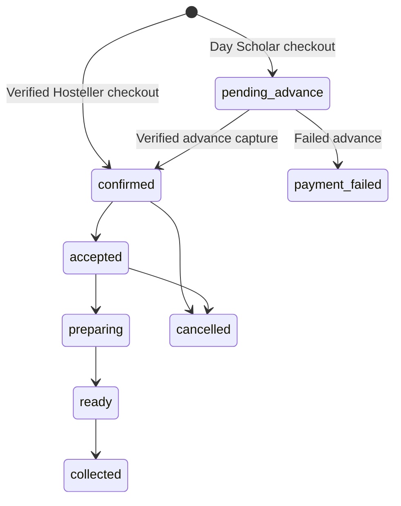

# System workflow

```mermaid
flowchart LR
 Browser[React / Vite] -->|Supabase access token| API[Express REST API]
 Browser -->|Auth SDK| Auth[Supabase Auth]
 API -->|Verified identity + server-only operations| DB[(Supabase PostgreSQL)]
 API -->|Create advance order| RP[Razorpay Test Mode]
 RP -->|Signed capture webhook| API
 DB -->|RLS, foreign keys, checks| DB
```

```mermaid
stateDiagram-v2
 [*] --> pending_advance: Day Scholar checkout
 [*] --> confirmed: Verified Hosteller checkout
 pending_advance --> confirmed: Verified advance capture
 pending_advance --> payment_failed: Failed advance
 confirmed --> accepted
 accepted --> preparing
 preparing --> ready
 ready --> collected
 confirmed --> cancelled
 accepted --> cancelled
```
